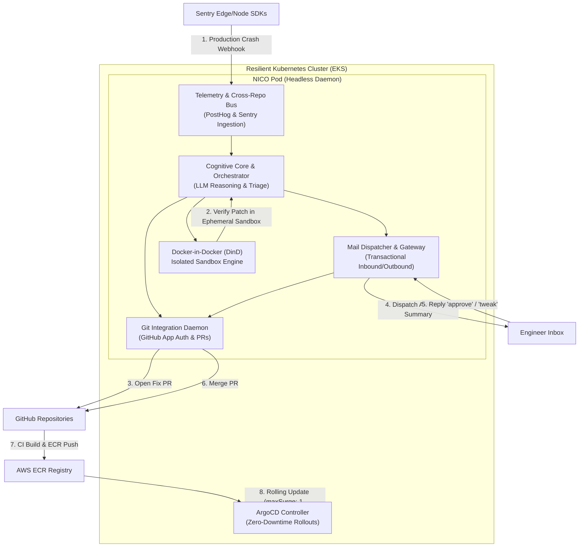

# 🤖 NXC-NICO (Node Infrastructure & Cluster Orchestrator)

> **Autonomous Containerized DevOps Engineer** deployed on Kubernetes to manage software lifecycle, self-healing bug fixes, GitOps deployments, and email-driven human-in-the-loop coordination.

---

## 🏗️ System Architecture



---

## 🧩 Core Subsystems & Module Breakdown

| Subsystem | Module | Key Responsibilities |
| :--- | :--- | :--- |
| **1. Cognitive Core** | `src/cognitive/` | LLM triage engine (Gemini, Claude, GPT), AST/codebase search, root-cause diagnosis, unified diff patch generation. |
| **2. Sandbox Engine** | `src/sandbox/` | Docker-in-Docker (DinD) ephemeral containers, repo checkout, patch application, isolated test execution & failure parsing. |
| **3. Git Daemon** | `src/git/` | GitHub App authentication, automated branch creation, commit signing, PR generation, automated code reviews, auto-merging. |
| **4. Telemetry Bus** | `src/telemetry/` | Sentry webhook receiver and signature validation, PostHog entity bus treating services as `distinct_id` entities, cross-repo dependency ripples. |
| **5. Mail Gateway** | `src/mail/` | Transactional email delivery (Resend / SendGrid / SMTP / Console), inbound reply parser, human instruction interpreter (`approve`, `tweak`, `rollback`). |

---

## 🔄 End-to-End Operational Workflows

### 🔴 Workflow A: Self-Healing Production Bug Fix
1. **Trigger**: An unhandled exception occurs in production; Sentry catches it and fires a webhook to NICO (`POST /webhooks/sentry`).
2. **Analysis**: NICO's Cognitive Core inspects the stack trace, identifies the culprit repository (`nxc-auth-service`), file, and line, and generates a candidate patch.
3. **Sandbox Verification**: NICO spins up an ephemeral container via DinD, checks out the code, applies the unified diff, and executes the test suite in total isolation.
4. **Action & Outreach**: Once tests pass, NICO pushes the commit, opens a Pull Request, and dispatches a rich email: *"I found a null pointer in nxc-auth-service, patched it, verified it in a sandbox, and opened PR #12."*
5. **Human Feedback**: The engineer replies directly to the email with `"approve"` or `"tweak: <notes>"`. NICO parses the inbound webhook and merges the PR.

### 🟢 Workflow B: Infrastructure Provisioning & GitOps Deployment
1. **Trigger**: Code or IaC changes merged into the repository.
2. **CI Pipeline**: GitHub Actions (`.github/workflows/ci-cd.yml`) lints, tests, builds the container image, and pushes to AWS ECR.
3. **CD Sync**: ArgoCD detects the new image tag and synchronizes cluster workloads using zero-downtime rolling updates (`maxSurge: 1, maxUnavailable: 0`).
4. **Telemetry Report**: NICO verifies pod readiness probes and sends a deployment receipt email confirming a healthy rollout.

---

## 🚀 Quickstart & Local Simulations

### 1. Installation & Typecheck
```bash
# Navigate to the workspace
cd C:\Users\dell\.gemini\antigravity-ide\scratch\nxc-nico

# Install dependencies
npm install

# Verify TypeScript compilation
npm run typecheck
```

### 2. Run Interactive Simulations

#### Simulate Workflow A (Self-Healing Bug Fix Loop)
```bash
npm run simulate:workflow-a
```
*Simulates a Sentry crash alert, AST diagnosis, DinD sandbox run, PR opening, and alert email dispatch.*

#### Simulate Inbound Email Approval & Merge
```bash
npm run simulate:inbound-approval
```
*Simulates an engineer replying `"approve"` to NICO's email, triggering the Git Daemon to merge the PR.*

#### Simulate Workflow B (GitOps Cluster Rollout)
```bash
npm run simulate:workflow-b
```
*Simulates ArgoCD cluster sync detection, health validation, and deployment receipt dispatch.*

### 3. Run with Docker Compose
```bash
docker compose up --build
```

---

## 📦 Infrastructure as Code (IaC) & Helm Deployment

### Terraform
Located in `iac/terraform/`:
- `main.tf`: VPC, subnets, ECR repository.
- `eks.tf`: Managed Kubernetes cluster (EKS 1.30), node groups, and IAM roles.
- `variables.tf` & `outputs.tf`.

### Helm Chart
Located in `iac/helm/nxc-nico/`:
- Deploys NICO's core pod alongside a privileged `docker:dind` sidecar.
- Configures RBAC (`ClusterRole` & `ServiceAccount`) to allow NICO to monitor and orchestrate cluster workloads.
- Rolling update strategy: `maxSurge: 1`, `maxUnavailable: 0`.

### ArgoCD GitOps
Located in `gitops/argocd/`:
- `nico-application.yaml`: Manages NICO deployment declaratively.
- `sample-microservice-app.yaml`: Sample microservice with rolling updates and auto-healing sync policy.
